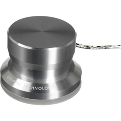
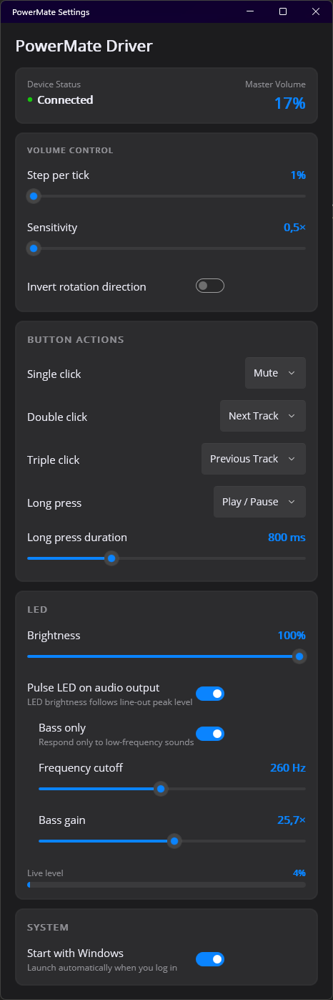

# PowerMate Driver for Windows

<p align="center">
  
</p>

A native Windows driver and settings app for the [Griffin PowerMate](https://en.wikipedia.org/wiki/Griffin_PowerMate) USB knob, built with .NET 10 and MAUI/WinUI.


## Features

- **Volume Control** — Rotate the knob to adjust system volume with configurable step size, sensitivity, and invert option
- **Media Keys** — Single, double, and triple click for play/pause, next track, and previous track (all configurable)
- **Long Press** — Configurable long-press action (mute, play/pause, or none)
- **LED Feedback** — LED brightness reflects current volume level in real time
- **Audio-Reactive LED** — LED pulses to audio output with optional bass-only mode using FFT analysis
- **Bass Detection** — Configurable frequency cutoff and gain for bass-reactive LED mode
- **System Tray** — Tray icon with a blue volume arc indicator that updates live; mute state shown with a red X overlay
- **Settings UI** — Dark-themed settings window with auto-save (400ms debounce)
- **Start with Windows** — Optional startup registration
- **Installer** — Inno Setup installer with desktop shortcut and uninstall support

## Screenshot

<p align="center">
  
</p>

## Requirements

- Windows 10 (build 19041) or later
- Griffin PowerMate USB (VID `077D`, PID `0410`)
- .NET 10 Runtime (included in installer)

## Installation

### Installer (Recommended)

Download the latest `PowerMateSetup.exe` from [Releases](https://github.com/Sipowiz/PowerMate/releases) and run it.

### Build from Source

```powershell
git clone https://github.com/Sipowiz/PowerMate.git
cd PowerMate
dotnet workload install maui-windows
dotnet build PowerMate/PowerMate.csproj -c Release -f net10.0-windows10.0.19041.0
```

The built executable will be in `PowerMate/bin/Release/net10.0-windows10.0.19041.0/win-x64/`.

## Configuration

Settings are stored in `%APPDATA%\PowerMate\config.json` and are auto-saved when changed in the UI.

| Setting | Default | Description |
|---------|---------|-------------|
| VolumeStep | 2 | Volume change per knob tick |
| Sensitivity | 1.0 | Rotation sensitivity multiplier |
| InvertRotation | false | Reverse rotation direction |
| ClickAction | PlayPause | Single click: PlayPause, Mute, or None |
| DoubleClickAction | NextTrack | Double click: NextTrack, PlayPause, Mute, or None |
| TripleClickAction | PreviousTrack | Triple click: PreviousTrack, PlayPause, Mute, or None |
| LongPressAction | Mute | Long press: Mute, PlayPause, or None |
| LongPressMs | 800 | Long press threshold in milliseconds |
| LedBrightness | 128 | Base LED brightness (0–255) |
| LedPulseOnAudio | false | Pulse LED to audio output |
| LedBassOnly | false | Pulse LED to bass frequencies only |
| BassFrequencyCutoff | 250 | Max frequency (Hz) for bass detection |
| BassGain | 5.0 | Bass level multiplier |
| StartWithWindows | false | Launch on Windows startup |

## Architecture

```
PowerMate/
├── Models/
│   └── PowerMateConfig.cs        # Settings model with JSON persistence
├── Services/
│   ├── IHidService.cs            # HID device interface
│   ├── IAudioService.cs          # Audio control interface
│   ├── HidService.cs             # PowerMate HID communication
│   ├── AudioService.cs           # NAudio volume + FFT bass detection
│   ├── PowerMateController.cs    # Main controller (multi-tap, LED, events)
│   ├── MediaKeyService.cs        # Simulated media key input
│   └── StartupService.cs         # Windows startup registration
├── ViewModels/
│   └── SettingsViewModel.cs      # MVVM with debounced auto-save
├── Views/
│   ├── SettingsPage.xaml          # Dark-themed settings UI
│   └── SettingsPage.xaml.cs
└── Platforms/Windows/
    ├── App.xaml.cs                # WinUI app + tray icon management
    └── TrayIconRenderer.cs       # GDI+ volume arc icon
```

## Dependencies

| Package | Version | Purpose |
|---------|---------|---------|
| [HidSharp](https://www.zer7.com/software/hidsharp) | 2.6.4 | USB HID device communication |
| [NAudio](https://github.com/naudio/NAudio) | 2.3.0 | Audio control, FFT, loopback capture |
| [H.NotifyIcon.WinUI](https://github.com/HavenDV/H.NotifyIcon) | 2.4.1 | System tray icon |
| System.Drawing.Common | 10.0.5 | Tray icon GDI+ rendering |

## Testing

```powershell
dotnet test PowerMate.Tests/PowerMate.Tests.csproj
```

24 unit tests covering rotation, multi-tap detection, long press, LED updates, config persistence, and connection events. Uses xUnit and NSubstitute.

## CI/CD

GitHub Actions builds and tests on every push to `main`. Pushing a version tag (e.g., `v1.0.0`) triggers a release build that compiles the installer and publishes it as a GitHub Release.

## License

This project is licensed under the [GPL-3.0 License](LICENSE).
