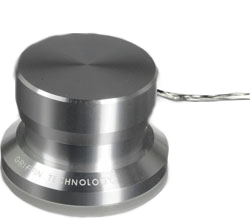

# PowerMate Driver for Windows

<p align="center">
  
</p>

A native Windows driver and settings app for the [Griffin PowerMate](https://en.wikipedia.org/wiki/Griffin_PowerMate) USB knob, built with .NET 10 and MAUI/WinUI.


## Features

- **Volume Control** — Rotate the knob to adjust system volume with configurable step size, sensitivity, and invert option
- **Media Keys** — Single, double, and triple click for play/pause, next track, and previous track
- **Long Press** — Mute/unmute on long press (configurable threshold)
- **Fast-Forward / Rewind** — Hold button and rotate to seek in the current media track; configurable seek step (1–30 s)
- **LED Feedback** — LED brightness reflects current volume level; falls back to volume when media is paused or stopped
- **Audio-Reactive LED** — LED pulses to audio output using WASAPI loopback RMS capture; optional bass-only mode with FFT analysis and configurable cutoff/gain
- **System Tray** — Dynamic tray icon shows a live blue volume arc, playback state symbol, and mute indicator
- **SMTC Integration** — Reads media session state (play/pause/stop) and flashes a skip symbol on the tray icon for next/previous track
- **Sleep/Hibernate** — Survives system suspend: audio capture stops cleanly before sleep and restarts automatically on resume
- **Crash Logging** — Unhandled exceptions written to `%AppData%\PowerMate\crash-YYYYMMDD.log` via Serilog (rolling daily, 30-day retention)
- **Settings UI** — Dark-themed settings window with auto-save
- **Start with Windows** — Optional startup registration
- **Installer** — Inno Setup installer with desktop shortcut, Start menu entry, and uninstall support

## Screenshot

<p align="center">
  
</p>

## Requirements

- Windows 10 (build 19041) or later
- Griffin PowerMate USB (VID `077D`, PID `0410`)
- .NET 10 Runtime (included in installer)

## Installation

### Installer (Recommended)

Download the latest `PowerMateSetup.exe` from [Releases](https://github.com/Sipowiz/PowerMate/releases) and run it.

### Build from Source

```powershell
git clone https://github.com/Sipowiz/PowerMate.git
cd PowerMate
dotnet workload install maui-windows
dotnet build PowerMate/PowerMate.csproj -c Release -f net10.0-windows10.0.19041.0
```

The built executable will be in `PowerMate/bin/Release/net10.0-windows10.0.19041.0/win-x64/`.

## Configuration

Settings are stored in `%APPDATA%\PowerMate\config.json` and are auto-saved when changed in the UI.

| Setting | Default | Description |
|---------|---------|-------------|
| VolumeStep | 2 | Volume change per knob tick (1–10) |
| Sensitivity | 1.0 | Rotation sensitivity multiplier (0.5–3.0) |
| InvertRotation | false | Reverse rotation direction |
| LongPressMs | 800 | Long-press threshold in milliseconds (300–2000) |
| TapWindowMs | 350 | Multi-tap detection window in milliseconds (150–800) |
| LedBrightness | 128 | Base LED brightness (0–255) |
| LedPulseOnAudio | false | Pulse LED to audio output |
| LedBassOnly | false | Pulse LED to bass frequencies only |
| BassFrequencyCutoff | 250 | Max frequency (Hz) for bass detection (60–500) |
| BassGain | 5.0 | Bass level multiplier (0.5–50) |
| FfRwThreshold | 3 | Rotation steps while held before entering FF/RW mode (1–10) |
| FfRwStepSeconds | 5 | Seconds to seek per rotation step during FF/RW (1–30) |
| StartWithWindows | false | Launch on Windows startup |

## Architecture

```
PowerMate/
├── Models/
│   └── PowerMateConfig.cs        # Settings model with JSON persistence
├── Services/
│   ├── IHidService.cs            # HID device interface
│   ├── IAudioService.cs          # Audio control interface
│   ├── IMediaSessionService.cs   # SMTC media session interface
│   ├── HidService.cs             # PowerMate HID communication
│   ├── AudioService.cs           # NAudio volume + WASAPI loopback + FFT
│   ├── MediaSessionService.cs    # Windows SMTC integration
│   ├── PowerMateController.cs    # Main controller (multi-tap, FF/RW, LED)
│   ├── MediaKeyService.cs        # Simulated media key input
│   ├── UpdateService.cs          # GitHub release update checker
│   └── StartupService.cs         # Windows startup registration
├── ViewModels/
│   └── SettingsViewModel.cs      # MVVM with debounced auto-save
├── Views/
│   ├── SettingsPage.xaml         # Dark-themed settings UI
│   ├── SettingsPage.xaml.cs
│   ├── CreditsPage.xaml          # About / credits page
│   └── CreditsPage.xaml.cs
└── Platforms/Windows/
    ├── App.xaml.cs               # WinUI app, tray icon, power management
    ├── Program.cs                # Custom entry point with try/catch/finally Serilog flush
    └── TrayIconRenderer.cs       # GDI+ dynamic tray icon renderer
```

## Dependencies

| Package | Version | Purpose |
|---------|---------|---------|
| [HidSharp](https://www.zer7.com/software/hidsharp) | 2.6.4 | USB HID device communication |
| [NAudio](https://github.com/naudio/NAudio) | 2.3.0 | Audio control, FFT, loopback capture |
| [H.NotifyIcon.WinUI](https://github.com/HavenDV/H.NotifyIcon) | 2.4.1 | System tray icon |
| [Serilog](https://serilog.net) | 4.3.1 | Structured crash logging |
| Serilog.Sinks.File | 7.0.0 | Rolling daily log files |
| System.Drawing.Common | 10.0.5 | Tray icon GDI+ rendering |

## Testing

```powershell
dotnet test PowerMate.Tests/PowerMate.Tests.csproj
```

163 unit tests covering rotation, multi-tap detection, long press, FF/RW, LED updates, audio-pulse fallback, power management (suspend/resume), crash logging, config persistence, and connection events. Uses xUnit and NSubstitute.

## CI/CD

GitHub Actions builds and tests on every push to `main`. Pushing a version tag (e.g., `v1.0.0`) triggers a release build that compiles the installer and publishes it as a GitHub Release.

## Changelog

See [CHANGELOG.md](CHANGELOG.md) for a detailed list of changes per release.

## License

This project is licensed under the [GPL-3.0 License](LICENSE).
